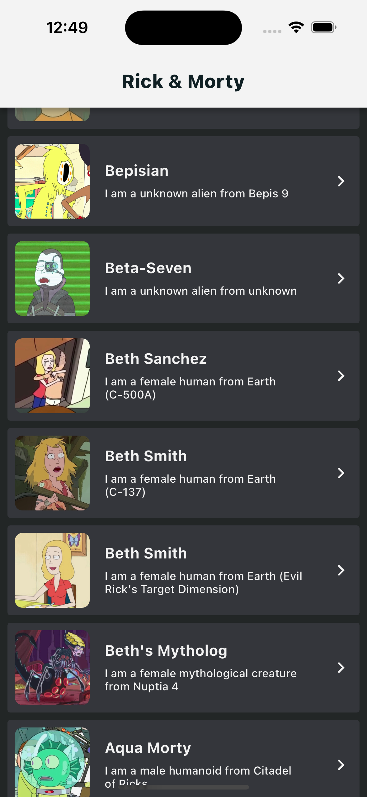

# Littlefish Flutter Technical Assessment

## Screen shots

## General Comments

Please commit all your code to a single Github repo. Each question should be in its own folder; and we’re expecting to see multiple commits as you progress. Please don’t just commit once on the last day of the assessment. 

Looking forward to seeing your code and good luck!

## Question 1

Create a simple application that displays a number on the screen – and has 2 buttons, a plus and a minus. The buttons should update the number accordingly. Use the BLoC pattern to manage your state and remember to keep in mind Flutter best practices like private variables, state immutability and using final variables.

## Question 2

Repeat the same task as above – only this time; use Redux as your state architecture.

## Question 3

Design a simple page that retrieves a paginated list of characters from this endpoint: https://rickandmortyapi.com. Once retrieved, display each character in a list (use your creativity in the design of the layout), ensuring that you also display the image, and some key details like name etc. When you select a specific character – open a full screen modal that displays more in-depth information on that character. Please use a repository pattern when connecting to your services, and ensure your invert your dependencies correctly.

Note: you are allowed to use 3rd party packages – provided you also have the relevant abstractions, and we do expect to see some form of state management as well.

## Question 4

Design and implement a federated Flutter plugin to check if a device has internet connectivity. This plugin should have the following:

A way to check if the device currently has internet connectivity.
An event stream to notify the app when the connectivity status changes.
